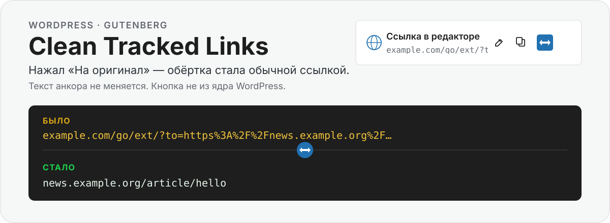
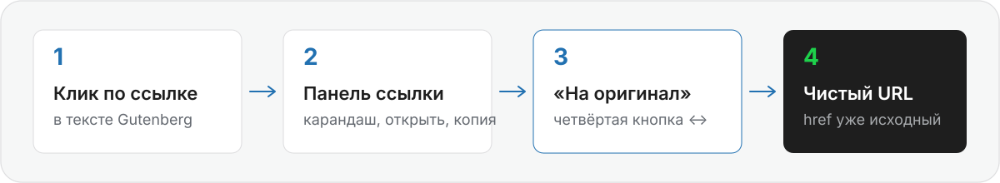

<p align="center">
  
</p>

WordPress-плагин для редактора. Кнопка **не из ядра WordPress** — плагин сам добавляет её в popover уже существующей ссылки.

<p align="center">
  
</p>

## Пример

Нажал — обёртка стала обычной ссылкой. Текст анкора тот же.

| Было | Стало |
| --- | --- |
| `https://www.klerk.ru/go/ext/?to=https%3A%2F%2Fwww.vedomosti.ru%2Fbusiness%2Farticles%2F2026%2F07%2F06%2F1211353-nedorogoi-ikri-mozhet-stat-menshe&entityId=123` | `https://www.vedomosti.ru/business/articles/2026/07/06/1211353-nedorogoi-ikri-mozhet-stat-menshe` |
| `https://example.com/news/hello?utm_source=tg&yclid=123` | `https://example.com/news/hello` |
| `https://example.com/news/hello` | без изменения |

Если развернуть нельзя, href не трогается. Повторный клик по чистой ссылке её не портит.

## Установка

1. Скачайте ZIP: [Code → Download ZIP](https://github.com/A-Krivoshen/clean-tracked-links/archive/refs/heads/main.zip).
2. Положите папку в `/wp-content/plugins/clean-tracked-links/`.
3. Плагины → активировать **Clean Tracked Links**.
4. В Gutenberg кликните по ссылке и нажмите ↔ **«На оригинал»**.
5. Если Gutenberg нет — та же кнопка есть в классическом редакторе (тулбар и окно «Вставить/редактировать ссылку») и во встроенных WYSIWYG на произвольных полях (ACF и другие `wp_editor()`).

```text
wp-content/plugins/clean-tracked-links/clean-tracked-links.php
```

Нужны WordPress 6.4+, PHP 8.1+. Сборки и npm нет.

Пока запрос идёт, кнопка disabled и показывает «Разворачиваю…». Успех — «Готово». Уже чистая ссылка — «Уже обычная ссылка». Иначе — «Не удалось найти исходную ссылку».

## Как разворачивает

Логика на сервере: `POST /wp-json/clean-tracked-links/v1/unwrap` (право `edit_posts`). JS сам только быстро достаёт `to` / `url` / `target`.

1. Параметры цели по очереди: `to`, `url`, `target`, `u`, `dest`, `destination`, `redirect`, `redirect_url`, `link`. Декодирует, вложенные обёртки — до 3 раз.
2. Если параметра нет, но URL похож на промежуточный редирект — HEAD (иначе ограниченный GET), без тела страницы, берётся `Location`. Максимум 3 редиректа, 5 секунд.
3. У почти чистого URL срезаются только служебные метки: `utm_*`, `yclid`, `ysclid`, `gclid`, `fbclid`, `_openstat`, `from`, `eref`, `ref`, `ref_src`. `id`, `article`, `slug`, `page` не трогаются.

Только `http`/`https`. Localhost, private/reserved, link-local и metadata-хосты не резолвятся. Результат проходит `wp_http_validate_url` и `esc_url_raw`.

## Это не

- не автозамена ссылок у посетителей сайта
- не массовая чистка старых постов
- не страница настроек и не новый блок

## Разработка

ИП Кривошеин А.С. · [krivoshein.site](https://krivoshein.site) · [Отзывы](https://yandex.ru/maps/org/ip_krivoshein_aleksey_sergeyevich/100156734340/reviews/) · [aleskey@krivoshein.site](mailto:aleskey@krivoshein.site)

## License

[MIT](LICENSE) © 2026 Aleksey Krivoshein
